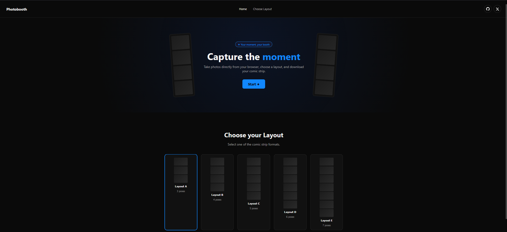

<div align="center">

# Photobooth

**Capture the moment.**

Um photobooth desenvolvido com React e Vite para capturar fotos diretamente pelo navegador, escolher diferentes layouts e criar sua própria sequência de fotos.

<br>


</div>

---

## Preview

<div align="center">



</div>

---

## Sobre o projeto

O **Photobooth** é uma aplicação web que utiliza a câmera do dispositivo para capturar fotos e transformá-las em uma sequência personalizada.

O usuário pode escolher entre diferentes layouts, capturar suas fotos e gerar o resultado final para download.

O projeto foi desenvolvido com foco em uma interface simples, moderna e intuitiva.

---

## Funcionalidades

* Acesso à câmera diretamente pelo navegador
* Captura de fotos
* Contagem regressiva antes das fotos
* Escolha de diferentes layouts
* Visualização das fotos capturadas
* Geração da sequência final
* Download do resultado
* Navegação entre as páginas
* Interface responsiva

---

## Layouts

A aplicação possui diferentes formatos para a sequência de fotos:

| Layout | Fotos |
| :----: | :---: |
|    A   |   3   |
|    B   |   4   |
|    C   |   5   |
|    D   |   6   |
|    E   |   7   |

---

## Tecnologias

<div align="center">

| Tecnologia | Utilização                     |
| :--------: | ------------------------------ |
|    React   | Construção da interface        |
|    Vite    | Desenvolvimento e build        |
| JavaScript | Lógica da aplicação            |
|     CSS    | Estilização                    |
|    HTML    | Estrutura da aplicação         |
| Camera API | Acesso à câmera do dispositivo |

</div>

---

## Estrutura do projeto

```text
photobooth/
├── public/
│
├── src/
│   ├── app/
│   │   ├── App.jsx
│   │   └── main.jsx
│   │
│   ├── components/
│   │   ├── Landing.jsx
│   │   ├── NavBar.jsx
│   │   └── Photobooth.jsx
│   │
│   ├── hooks/
│   │   └── useCamera.js
│   │
│   └── style/
│       ├── App.css
│       ├── Landing.css
│       ├── NavBar.css
│       └── Photobooth.css
│
├── .gitignore
├── index.html
├── package.json
├── package-lock.json
└── vite.config.js
```

---

## Como executar

### 1. Clone o repositório

```bash
git clone https://github.com/preislerbtw/web-photobooth.git
```

### 2. Entre na pasta do projeto

```bash
cd web-photobooth/photobooth
```

### 3. Instale as dependências

```bash
npm install
```

### 4. Execute o projeto

```bash
npm run dev
```

Depois, abra no navegador o endereço fornecido pelo Vite.

---

## Câmera

Para utilizar o Photobooth, o navegador precisa ter permissão para acessar a câmera do dispositivo.

Ao iniciar a aplicação, permita o acesso quando o navegador solicitar.

---

## Objetivos do projeto

Este projeto foi desenvolvido principalmente para praticar conceitos de desenvolvimento web, incluindo:

* React
* Componentização
* Hooks
* Hooks personalizados
* Gerenciamento de estados
* Manipulação de elementos
* API de câmera do navegador
* Manipulação de imagens
* CSS
* Vite

---

## Status

**Em desenvolvimento**

Novas funcionalidades e melhorias podem ser adicionadas ao projeto futuramente.

---

<div align="center">

### Photobooth

Capture the moment.

</div>
